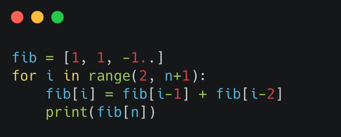
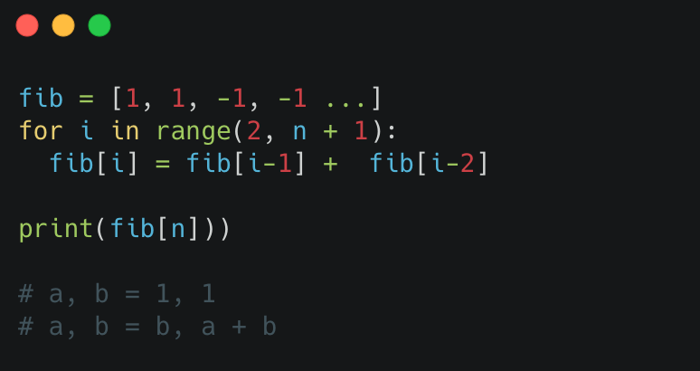
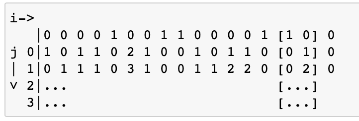
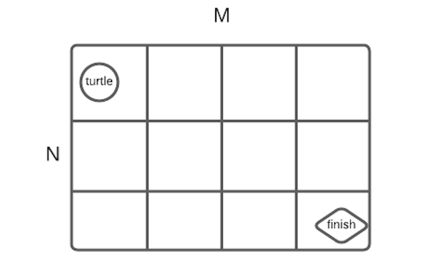
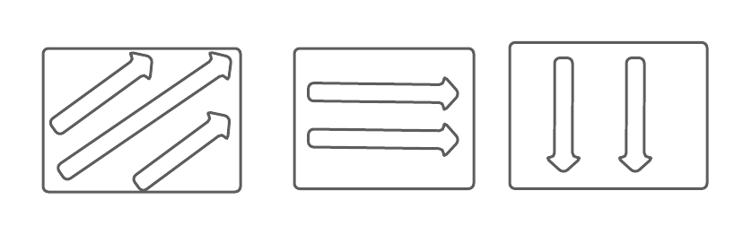
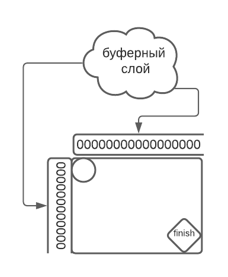

##### Конспект:

 # Основы динамического программирования
 **Вычисление i-го числа Фибоначчи**
 В следующей реализации время работы программы растет экспоненциально в зависимости от i:
 
 
 

 Можем запомнить значения. Введем глобальный тип fibg и заполним его -1. 
 
 
 
 Эта реализация позволяет поддерживать линейную сложность, поскольку каждое значение мы будет вычислять не более одного раза. 

 ## (Не) немножко правил
 1. Определить, что такое dp[ i ] (либо dp[ i ][ j ]..)
 2. Определить базу динамики - некоторое исходное значение, из которого мы можем начинать пересчитывать нашу задачу
 3. Определить формулу
 4. Определить порядок пересчета
 5. Понять, где лежит отрезок

 **Задача 1**: есть некоторое поле из 0 и 1. 
 Кузнечик умеет прыгать по одномерному массиву на две / три клетки вперед. 
 Мы хотим узнать суммарное количество путей, которыми кузнечик может пропрыгать
 | 0 | 1 | 0 | 0 | 0 | 0 | 1 | 0 | 0 |

 - dp[ i ] - количество путей, которым можно попасть в ячейку
 - dp[ 0 ] = 1
 - dp[ i ] = d[ i-2 ] + dp[ i-3 ] - если в клетке 0, dp[ i ] = 0 - если в клетке 1

 **Задача 2**: Распишем по правилам числа Фибоначчи

 - dp[ i ] - i-е число Фибоначчи
 - база: dp[ 0 ] = 1, dp[ 1 ] = 1
 - порядок пересчета: dp[ i ] = dp[ i-1 ] + dp[ i-2 ]
 - порядок счета: по возрастанию i 
 - где лежит ответ: dp[ n ]

 **Задача 3**: снова есть кузнечик, который умеет прыгать вперед на 2 и 3, но еще он может делать 3 раза шаг назад

 Снова представим поле:
 0 0 0 0 1 0 0 1 1 0 0 0 0 1 1 0 0

 Можно запоминать, сколько шагов кузнечик успел сделать назад

 - dp[ i ][ j ] - сколько путей имеется, чтобы оказаться в точке i и сделать j  шагов назад
 - dp[ 0 ][ 0 ] = 1
 - dp[ i ][ 0 ] = dp[ i-2 ][ 0 ] + dp[ i-3 ][ 0 ] - для 0; dp[ i ][ любое ] = 0 - для единицы
 - dp[ i ][ j ] - мы хотим предположить, что именно в i позиции был сделан шаг назад, но чтобы понять, сколько путей было до этого шага назад: dp[ i+1 ][ j-1 ]
 - порядок пересчета: dp[ i ][ j ] - возрастают i и  j
 - где лежит ответ: dp[ i-2 ][ любое j ] + dp[ i-3 ][ любое j ]

 Для этой задачи массив будет выглядеть сложнее: нужно завести доп. 4 строки

 
 
 Ответ будет лежать в сумме двух предпоследних столбцов

 **Задача 4**: есть поле N x M, в левом верхнем углу стоит черепашка, которая умеет делать один шаг вправо / один шаг вниз. 
 Каким количеством путей черепашка может добраться до правого нижнего угла?
 
 
 
 - Определимся в размерностями динамики: dp[ i ][ j ] <- каким количеством путей можно попасть в (i, j) 
 - dp[ 0 ][ 0 ] = 1
 - f[ i ][ j ] = 1 : 0, если есть препятствие, то равен нулю, поскольку попасть мы туда не можем, а если равен нулю f[ i ][ j ] = 0, то dp[ i -1 ][ j ] + d[ i ][ j -1 ] (здесь f - это поле)
 - ответ лежит: dp[ m - 1 ][ n - 1 ]

 Порядки пересчета бывают разные:
 
 
 
 Можно добавить буферный слой из 0, чтобы не выходить за пределы
 
 
 
 
 **Задача 5**: Продолжает быть черепашка, живущая в Сингапуре и едет на машине. 
 За посещение каждой клетки черепашке нужно платить штраф f[ i ][ j ]. С каким минимальным штрафом она может доехать?
 
 
 - dp[ i ][ j ] - минимальная сумма штрафа в (i, j)
 - dp[ i ][ j ] = min(dp[ i-1 ][ j ], dp[ i ][ j-1 ]) + t[ i ][ j ], где t штраф в этой клетке
 - обратно пробежаться по матрице по пути наименьших значений
 - dp[ m ][ n ] = (M|N, 1)
 **Задача 6**: определить количество последовательностей длины n из 0 и 1 с количеством единиц не более трех подряд
 - dp[ i ][ k ] - количество последовательностей длины i с k единицами на конце
 - dp[ 0 ][ 0 ] =1, dp[ 0 ][ k ] = 0
 - dp[ i ][ 0 ] = dp[ i-1 ][ любое], dp[ i ][ k ] = dp[ i-1 ][ k-1 ]
 - сверху вниз по массиву
 - dp[ n + 1][ 0 ]
